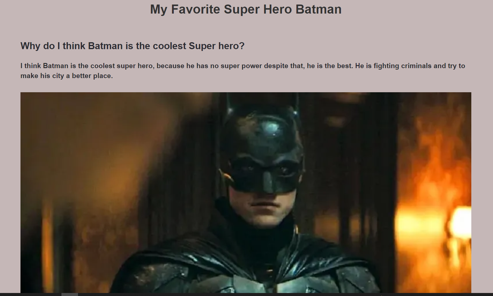

# Batman is my superhero


> A simple website about Batman and why he is my favorite superhero.

## Table of contents
- [](#)
  - [Table of contents](#table-of-contents)
  - [General info](#general-info)
  - [Screenshots](#screenshots)
  - [Technologies](#technologies)
  - [Setup](#setup)
  - [Code Examples](#code-examples)
  - [Features](#features)
  - [Status](#status)
  - [Inspiration](#inspiration)
  - [Contact](#contact)

## General info

A simple website build using `CSS` and `HTML` , the goal is learning development strategy and project management.

## Screenshots


## Technologies
* HTML
* CSS
* VSC code


## Setup
open index.html in your browser and enjoy! 

## Code Examples

```html
<!DOCTYPE html>
<html lang="en">
    <head>
        <meta charset="UTF-8">
        <meta http-equiv="X-UA-Compatible" content="IE=edge">
        <meta name="viewport" content="width=device-width, initial-scale=1.0">       
        <link rel="stylesheet" href="style.css">
        <title>My favorite Super Hero</title>
    </head>
    <body>

        <!-- Title  -->
       <header>
           <h1>My Favorite Super Hero Batman</h1>
       </header>

       <!-- Content  -->
        <div class="content">
            <h2>Why do I think Batman is the coolest Super hero?</h2>
            <p>
                I think Batman is the coolest super hero, because he has no super power despite that, he is the best.
                He is fighting criminals and try to make his city a better place.
            </p>
        </div>

       <!-- Images  -->
       <div class="batman-img">
           
       </div> 
       
       <!-- footer  -->
       <footer>
           <p>
               &copy; 2022, Batman's fan. All rights reserved.
           </p>
        </footer>        
    </body>
</html>


```


## Features
List of features ready and TODOs for future development

* 
* 
* 

To-do list:

* 
* 

## Status
Project is: _in progress_

## Inspiration


## Contact
By [HYF-team] 


